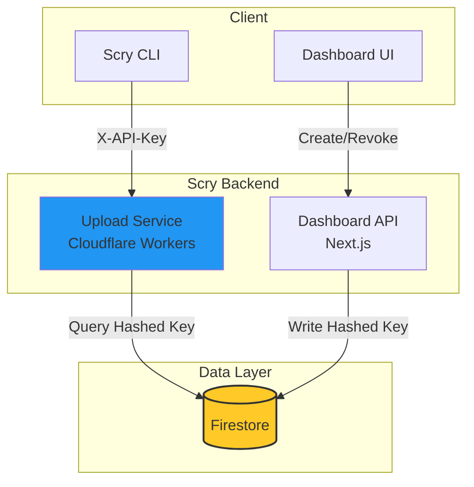

# Firebase API Key Authentication - Implementation Plan

**Project**: Scry Storybook Upload Service
**Solution**: Custom Implementation using Firestore
**Priority**: High
**Estimated Effort**: 3-5 days
**Status**: Ready for Implementation

---

## Table of Contents

1. [Overview](#overview)
2. [Architecture](#architecture)
3. [Data Model](#data-model)
4. [Security Design](#security-design)
5. [Implementation Steps](#implementation-steps)
6. [Testing Strategy](#testing-strategy)
7. [Deployment](#deployment)

---

## Overview

This plan implements a custom API key management system using **Google Cloud Firestore** as the storage backend. This leverages your existing Firebase infrastructure, avoiding external dependencies like Unkey.

### Key Features
*   **Project-Scoped Keys**: Keys are stored as subcollections of projects.
*   **Secure Hashing**: Keys are hashed (SHA-256) before storage; raw keys are never stored.
*   **Show-Once**: Raw keys are returned only upon creation.
*   **Rate Limiting**: Implemented via Firestore counters or simple timestamp checks (basic).
*   **Cost Effective**: Uses existing Firebase plan (reads/writes are minimal compared to build data).

---

## Architecture



---

## Data Model

### Collection Structure
```
projects/{projectId}/apiKeys/{keyId}
```

### Document Schema (`ApiKey`)
```typescript
interface ApiKeyDoc {
  id: string;
  name: string;           // e.g., "CI/CD Key"
  prefix: string;         // e.g., "scry_proj_abc..." (first 8 chars of raw key)
  hash: string;           // SHA-256 hash of the full raw key
  status: 'active' | 'revoked';
  createdAt: Timestamp;
  createdBy: string;      // User ID
  lastUsedAt?: Timestamp; // Updated on successful auth
  expiresAt?: Timestamp;  // Optional
}
```

---

## Security Design

1.  **Key Format**: `scry_proj_{projectId}_{randomString}`
    *   Prefix: `scry_proj_`
    *   Project ID: Ensures keys are scoped to a specific project.
    *   Randomness: 32 bytes of random data (base62 encoded).
2.  **Hashing**:
    *   We store `SHA-256(rawKey)`.
    *   We **NEVER** store the raw key.
    *   Comparison is done by hashing the incoming key and querying for the hash.
3.  **Lookup Strategy**:
    *   To avoid scanning all keys, we can query by `prefix` AND `hash` (if we want to be extra safe against collisions, though SHA-256 is safe).
    *   Actually, since we know the `projectId` from the URL (e.g., `/upload/:project/...`), we can just query the `apiKeys` subcollection of that project.
    *   Query: `collection('projects').doc(projectId).collection('apiKeys').where('hash', '==', hashedInput).where('status', '==', 'active')`

---

## Implementation Steps

### Phase 1: Shared Logic (1 day)

1.  **Key Generator**: Create a utility to generate secure keys.
2.  **Hasher**: Create a utility to hash keys using SHA-256 (using `crypto` in Node/Workers).
3.  **Types**: Define TypeScript interfaces for the Firestore documents.

### Phase 2: Dashboard Implementation (1-2 days)

1.  **API Route: Create Key**
    *   Generate raw key.
    *   Hash raw key.
    *   Save document to Firestore.
    *   Return raw key to user (ONLY ONCE).
2.  **API Route: List Keys**
    *   Query Firestore for all keys in project.
    *   Return metadata (name, prefix, status, etc.) but NOT the hash.
3.  **API Route: Revoke Key**
    *   Update status to `revoked`.
4.  **UI Components**
    *   "API Keys" section in Project Settings.
    *   "Create Key" dialog with "Copy" button.
    *   List view with "Revoke" action.

### Phase 3: Upload Service Implementation (1 day)

1.  **Middleware (`auth.ts`)**
    *   Extract `X-API-Key` header.
    *   Parse `projectId` from the key prefix (optional validation) or just use the route param.
    *   Hash the incoming key.
    *   Query Firestore: `projects/{projectId}/apiKeys` where `hash == incomingHash` AND `status == 'active'`.
    *   If found:
        *   Update `lastUsedAt` (fire-and-forget to avoid latency).
        *   Allow request.
    *   If not found: Return 401.

### Phase 4: CLI Implementation (2 hours)

1.  **Update `deploy` command**
    *   Accept `--api-key` flag.
    *   Read `SCRY_API_KEY` env var.
    *   Send `X-API-Key` header.

---

## Testing Strategy

1.  **Unit Tests**:
    *   Test key generation format.
    *   Test hashing consistency.
    *   Test middleware logic (mock Firestore).
2.  **Integration Tests**:
    *   Create key via Dashboard API.
    *   Use key to authenticate Upload Service.
    *   Revoke key.
    *   Verify Upload Service rejects revoked key.

---

## Deployment

1.  **Firestore Rules**: Update security rules to allow:
    *   Project owners/admins to read/write `apiKeys` collection.
    *   Upload Service (Service Account) to read/write `apiKeys` collection.
2.  **Deploy Dashboard**: Vercel deployment.
3.  **Deploy Upload Service**: Cloudflare Workers deployment.
