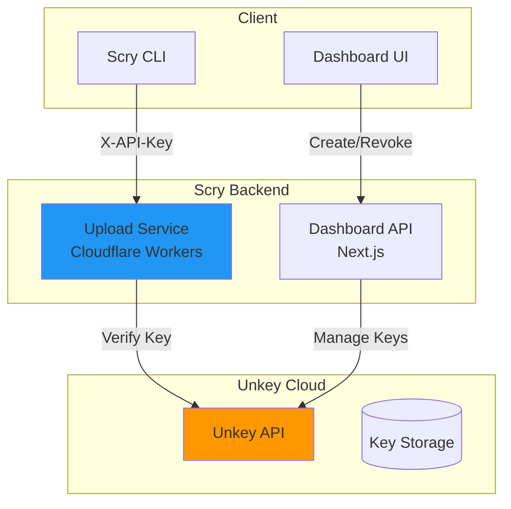

# Hosted Unkey API Key Authentication - Implementation Plan

**Project**: Scry Storybook Upload Service  
**Solution**: Unkey Hosted (SaaS)  
**Priority**: High  
**Estimated Effort**: 4-6 hours  
**Status**: Ready for Implementation

---

## Table of Contents

1. [Overview](#overview)
2. [Architecture](#architecture)
3. [Implementation Steps](#implementation-steps)
4. [Code Implementation](#code-implementation)
5. [Dashboard Integration](#dashboard-integration)
6. [Testing Strategy](#testing-strategy)
7. [Deployment](#deployment)

---

## Overview

This plan implements API key authentication using **Unkey's Hosted Service**. This is the fastest path to securing the upload service, requiring minimal code and zero infrastructure management.

### Key Features
*   **Project-Scoped Keys**: One key per project.
*   **Secure Storage**: Keys are hashed and stored by Unkey.
*   **Rate Limiting**: Built-in protection against abuse.
*   **Analytics**: Usage tracking included.
*   **Show-Once**: Secure key display in dashboard.

---

## Architecture



---

## Implementation Steps

### Step 1: Unkey Setup (15 mins)
1.  Sign up at [unkey.dev](https://unkey.dev).
2.  Create a new API named "Scry Storybook".
3.  Get **Root Key** and **API ID**.
4.  Set key prefix to `scry_`.

### Step 2: Install SDK (5 mins)
```bash
# Upload Service
cd scry-storybook-upload-service
npm install @unkey/api

# Dashboard
cd scry-developer-dashboard
npm install @unkey/api
```

### Step 3: Environment Variables (10 mins)
```bash
# .env (Upload Service) & .env.local (Dashboard)
UNKEY_ROOT_KEY=unkey_xxxxxxxxxxxxx
UNKEY_API_ID=api_xxxxxxxxxxxxx
```

---

## Code Implementation

### 1. Authentication Middleware (Upload Service)

Create `src/middleware/auth.ts`:

```typescript
import { Unkey } from '@unkey/api';
import type { Context, Next } from 'hono';

const unkey = new Unkey({ token: process.env.UNKEY_ROOT_KEY! });

export async function apiKeyAuth(c: Context, next: Next) {
  const apiKey = c.req.header('x-api-key');

  if (!apiKey) {
    return c.json({ error: 'Missing API key' }, 401);
  }

  const { result, error } = await unkey.keys.verify({
    key: apiKey,
    apiId: process.env.UNKEY_API_ID!,
  });

  if (error || !result.valid) {
    return c.json({ error: 'Invalid API key' }, 401);
  }

  // Inject project ID from metadata
  c.set('authenticatedProjectId', result.meta?.projectId);
  c.set('apiKeyId', result.keyId);

  await next();
}
```

### 2. Apply Middleware (Upload Service)

Update `src/app.ts`:

```typescript
import { apiKeyAuth } from './middleware/auth';

// Protect routes
app.use('/upload/*', apiKeyAuth);
app.use('/presigned-url/*', apiKeyAuth);

// Verify project match
app.openapi(uploadRoute, async (c) => {
  const { project } = c.req.valid('param');
  const authProject = c.get('authenticatedProjectId');

  if (project !== authProject) {
    return c.json({ error: 'Project mismatch' }, 403);
  }
  // ... existing logic
});
```

---

## Dashboard Integration

### 1. API Route: Create Key

Create `app/api/projects/[projectId]/api-keys/route.ts`:

```typescript
import { Unkey } from '@unkey/api';
import { NextResponse } from 'next/server';

const unkey = new Unkey({ token: process.env.UNKEY_ROOT_KEY! });

export async function POST(req: Request, { params }: { params: { projectId: string } }) {
  // TODO: Add user auth check here
  
  const { name } = await req.json();
  
  const { result, error } = await unkey.keys.create({
    apiId: process.env.UNKEY_API_ID!,
    prefix: `scry_${params.projectId.substring(0, 8)}`,
    ownerId: params.projectId,
    name,
    meta: { projectId: params.projectId },
    ratelimit: {
      type: 'fast',
      limit: 100,
      refillRate: 10,
      refillInterval: 60000,
    },
  });

  if (error) return NextResponse.json({ error: error.message }, { status: 500 });

  return NextResponse.json(result); // Returns key only once!
}
```

### 2. API Route: List Keys

```typescript
export async function GET(req: Request, { params }: { params: { projectId: string } }) {
  // TODO: Add user auth check here

  const { result, error } = await unkey.keys.list({
    apiId: process.env.UNKEY_API_ID!,
    ownerId: params.projectId,
  });

  if (error) return NextResponse.json({ error: error.message }, { status: 500 });

  return NextResponse.json({ keys: result.keys });
}
```

### 3. API Route: Revoke Key

Create `app/api/projects/[projectId]/api-keys/[keyId]/route.ts`:

```typescript
export async function DELETE(req: Request, { params }: { params: { keyId: string } }) {
  // TODO: Add user auth check here

  const { error } = await unkey.keys.revoke({ keyId: params.keyId });

  if (error) return NextResponse.json({ error: error.message }, { status: 500 });

  return NextResponse.json({ success: true });
}
```

---

## Testing Strategy

1.  **Unit Tests**: Mock Unkey SDK to test middleware logic (success, missing key, invalid key, project mismatch).
2.  **Integration Tests**: Use a test project ID to create, verify, and revoke keys against the live Unkey API.
3.  **Manual Test**:
    *   Create key in Dashboard.
    *   Use `curl` to upload with key.
    *   Verify success.
    *   Revoke key.
    *   Verify failure.

---

## Deployment

1.  **Environment Variables**: Add `UNKEY_ROOT_KEY` and `UNKEY_API_ID` to Vercel (Dashboard) and Cloudflare (Upload Service).
2.  **Deploy Dashboard**: `vercel deploy --prod`
3.  **Deploy Upload Service**: `wrangler deploy`

---

**Document Version**: 1.0  
**Created**: 2025-11-21  
**Status**: Ready for Implementation