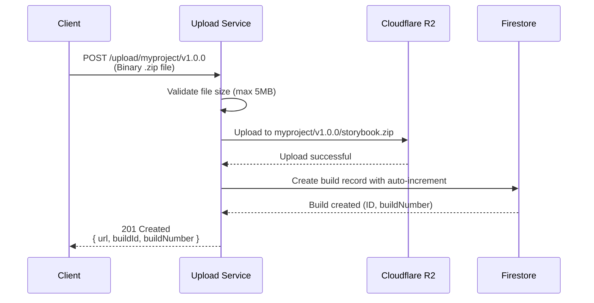
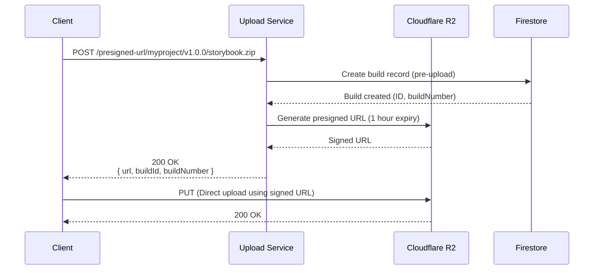
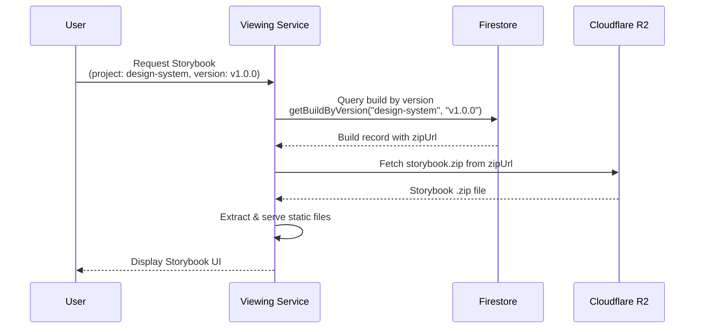

# Storybook Upload Service - Storage Flow Overview

**Document for the Storybook Viewing Service Team**

This document explains how Storybook builds are uploaded, stored, and made accessible for viewing. This information is critical for the team building the service that displays these Storybooks to users.

---

## 📋 Table of Contents

1. [Application Overview](#application-overview)
2. [Storage Architecture](#storage-architecture)
3. [File Storage Structure](#file-storage-structure)
4. [Upload Flow](#upload-flow)
5. [Build Tracking with Firestore](#build-tracking-with-firestore)
6. [Accessing Stored Storybooks](#accessing-stored-storybooks)
7. [Integration Guide for Viewing Service](#integration-guide-for-viewing-service)
8. [Environment Configuration](#environment-configuration)

---

## Application Overview

### What This Service Does

The **Storybook Upload Service** is a portable backend API that:

1. **Accepts Storybook build uploads** from CI/CD pipelines or developers
2. **Stores the builds** in Cloudflare R2 (S3-compatible object storage)
3. **Tracks build metadata** in Firestore with auto-incrementing build numbers
4. **Provides public URLs** for accessing the uploaded Storybook builds

### Key Features

- ✅ **Direct Upload**: Upload `.zip` files directly to the service via [`POST /upload/:project/:version`](src/app.ts:157)
- ✅ **Presigned URL Upload**: Get a secure upload URL for client-side uploads via [`POST /presigned-url/:project/:version/:filename`](src/app.ts:361)
- ✅ **Build Tracking**: Automatic registration in Firestore with sequential build numbers
- ✅ **Public Access**: All uploaded files are publicly accessible via R2 URLs
- ✅ **Multi-environment**: Supports Node.js, Docker, and Cloudflare Workers deployments

### Technology Stack

- **Runtime**: Cloudflare Workers (production) / Node.js (development)
- **Framework**: [Hono](https://hono.dev/) - Lightweight web framework
- **Storage**: Cloudflare R2 (S3-compatible object storage)
- **Database**: Google Firestore (build metadata and versioning)
- **Language**: TypeScript

---

## Storage Architecture

### Two-Tier Storage System

The service uses a **dual storage approach** for flexibility and performance:

#### 1. Object Storage (Cloudflare R2)

**Purpose**: Store the actual Storybook `.zip` files

- **Production Bucket**: `my-storybooks-production`
- **Staging Bucket**: `my-storybooks-staging`
- **Protocol**: S3-compatible API
- **Access**: Public read access enabled

**Implementation**:
- Worker environment: Uses native R2 bindings ([`storage.worker.ts`](src/services/storage/storage.worker.ts))
- Node.js environment: Uses AWS S3 SDK ([`storage.node.ts`](src/services/storage/storage.node.ts))

#### 2. Database (Firestore)

**Purpose**: Track build metadata, versions, and provide queryable build history

- **Collections Structure**:
  ```
  projects/{projectId}/
    ├── builds/{buildId}          # Individual build records
    └── counters/builds            # Auto-incrementing build numbers
  ```

**Implementation**: 
- Worker environment: REST API ([`firestore.worker.ts`](src/services/firestore/firestore.worker.ts))
- Node.js environment: Firebase Admin SDK ([`firestore.node.ts`](src/services/firestore/firestore.node.ts))

### Storage Service Abstraction

Both storage implementations conform to the [`StorageService`](src/services/storage/storage.service.ts:25) interface:

```typescript
interface StorageService {
  upload(key: string, body: ReadableStream | Buffer, contentType: string): Promise<UploadResult>;
  getPresignedUploadUrl(key: string, contentType: string): Promise<{ url: string; key: string }>;
  deleteByPrefix(prefix: string): Promise<void>;
}
```

This abstraction allows seamless switching between environments without code changes.

---

## File Storage Structure

### R2 Storage Path Pattern

All Storybook builds are stored using this hierarchical structure:

```
{bucket-name}/
  └── {project}/
      └── {version}/
          └── storybook.zip
```

**Example**:
```
my-storybooks-production/
  └── design-system/
      ├── v1.0.0/
      │   └── storybook.zip
      ├── v1.1.0/
      │   └── storybook.zip
      └── v2.0.0/
          └── storybook.zip
```

### Path Components

| Component | Description | Example | Constraints |
|-----------|-------------|---------|-------------|
| **project** | Project identifier | `design-system` | Alphanumeric, hyphens, underscores only |
| **version** | Version identifier | `v1.0.0`, `0.0.1`, `main-branch` | Any string (typically semver) |
| **filename** | File name | `storybook.zip` | Typically always `storybook.zip` |

### Key Construction

The storage key is constructed in [`app.ts`](src/app.ts:214):

```typescript
const key = `${project}/${version}/${filename}`;
// Example: "design-system/v1.0.0/storybook.zip"
```

---

## Upload Flow

### Method 1: Direct Upload

**Endpoint**: [`POST /upload/:project/:version`](src/app.ts:157)



**Request Example**:
```bash
curl -X POST \
  -H "Content-Type: application/zip" \
  --data-binary @storybook.zip \
  https://storybook-deployment-service.epinnock.workers.dev/upload/design-system/v1.0.0
```

**Response Example**:
```json
{
  "success": true,
  "message": "Upload successful",
  "key": "design-system/v1.0.0/storybook.zip",
  "data": {
    "url": "https://pub-my-storybooks-production.f54b9c10de9d140756dbf449aa124f1e.r2.dev/design-system/v1.0.0/storybook.zip",
    "path": "design-system/v1.0.0/storybook.zip",
    "versionId": "...",
    "buildId": "abc123def456",
    "buildNumber": 5
  }
}
```

### Method 2: Presigned URL Upload

**Endpoint**: [`POST /presigned-url/:project/:version/:filename`](src/app.ts:361)



**Request Example**:
```bash
# Step 1: Get presigned URL
RESPONSE=$(curl -X POST \
  -H "Content-Type: application/zip" \
  https://storybook-deployment-service.epinnock.workers.dev/presigned-url/design-system/v1.0.0/storybook.zip)

# Step 2: Extract URL and upload directly
PRESIGNED_URL=$(echo $RESPONSE | jq -r '.url')
curl -X PUT \
  -H "Content-Type: application/zip" \
  --data-binary @storybook.zip \
  "$PRESIGNED_URL"
```

**Response Example**:
```json
{
  "url": "https://f54b9c10de9d140756dbf449aa124f1e.r2.cloudflarestorage.com/my-storybooks-production/design-system/v1.0.0/storybook.zip?X-Amz-Algorithm=AWS4-HMAC-SHA256&X-Amz-Credential=...",
  "fields": {
    "key": "design-system/v1.0.0/storybook.zip"
  },
  "buildId": "abc123def456",
  "buildNumber": 5
}
```

### Upload Processing (Internal Flow)

The upload logic in [`app.ts`](src/app.ts:199) handles:

1. **Content-Type Detection**: Supports both `multipart/form-data` and raw binary (`application/zip`)
2. **File Size Validation**: 5MB maximum limit ([`app.ts:268`](src/app.ts:268))
3. **Storage Upload**: Delegates to [`StorageService.upload()`](src/services/storage/storage.service.ts:33)
4. **Build Registration**: Creates Firestore record via [`FirestoreService.createBuild()`](src/services/firestore/firestore.service.ts:14)
5. **Response Formatting**: Returns public URL and build metadata

---

## Build Tracking with Firestore

### Build Record Schema

Each upload creates a **Build** record in Firestore with this structure:

```typescript
interface Build {
  id: string;                    // Unique build identifier (auto-generated)
  projectId: string;             // Project name (e.g., "design-system")
  versionId: string;             // Version identifier (e.g., "v1.0.0")
  buildNumber: number;           // Auto-incrementing number (1, 2, 3...)
  zipUrl: string;                // Public R2 URL to the .zip file
  status: 'active' | 'archived'; // Build status
  createdAt: Date;               // Timestamp of upload
  createdBy: string;             // User/service identifier
}
```

### Firestore Data Structure

```
projects/
  ├── design-system/
  │   ├── builds/
  │   │   ├── abc123def456/
  │   │   │   ├── id: "abc123def456"
  │   │   │   ├── projectId: "design-system"
  │   │   │   ├── versionId: "v1.0.0"
  │   │   │   ├── buildNumber: 1
  │   │   │   ├── zipUrl: "https://pub-my-storybooks-production.../.../storybook.zip"
  │   │   │   ├── status: "active"
  │   │   │   ├── createdAt: 2025-10-31T00:00:00Z
  │   │   │   └── createdBy: "upload-service"
  │   │   └── xyz789ghi012/
  │   │       ├── buildNumber: 2
  │   │       └── ...
  │   └── counters/
  │       └── builds/
  │           └── currentBuildNumber: 2
  └── other-project/
      └── ...
```

### Auto-Incrementing Build Numbers

Build numbers are **project-specific** and increment automatically:

1. First upload to `design-system`: `buildNumber = 1`
2. Second upload to `design-system`: `buildNumber = 2`
3. First upload to `other-project`: `buildNumber = 1` (separate counter)

The counter is stored at `projects/{projectId}/counters/builds` and uses Firestore's atomic increment operation.

### Querying Builds

The [`FirestoreService`](src/services/firestore/firestore.service.ts) provides these query methods:

| Method | Description | Example |
|--------|-------------|---------|
| [`getBuild(projectId, buildId)`](src/services/firestore/firestore.service.ts:25) | Get specific build by ID | `getBuild("design-system", "abc123...")` |
| [`getProjectBuilds(projectId, status?, limit?)`](src/services/firestore/firestore.service.ts:37) | List all builds for project | `getProjectBuilds("design-system", "active", 50)` |
| [`getBuildByVersion(projectId, versionId)`](src/services/firestore/firestore.service.ts:49) | Find build by version | `getBuildByVersion("design-system", "v1.0.0")` |
| [`getLatestBuild(projectId)`](src/services/firestore/firestore.service.ts:59) | Get most recent build | `getLatestBuild("design-system")` |

---

## Accessing Stored Storybooks

### Public URL Pattern

All uploaded Storybooks are accessible via **public R2 URLs** with this pattern:

```
https://pub-{bucket-name}.{account-id}.r2.dev/{project}/{version}/storybook.zip
```

**Real Example**:
```
https://pub-my-storybooks-production.f54b9c10de9d140756dbf449aa124f1e.r2.dev/design-system/v1.0.0/storybook.zip
```

### URL Construction

The public URL is constructed in both storage implementations:

**Worker** ([`storage.worker.ts:40`](src/services/storage/storage.worker.ts:40)):
```typescript
this.publicUrlBase = `https://pub-${config.bucketName}.${config.accountId}.r2.dev`;
```

**Node.js** ([`storage.node.ts:37`](src/services/storage/storage.node.ts:37)):
```typescript
this.publicUrlBase = `https://pub-${config.bucketName}.${config.accountId}.r2.dev`;
```

### Public Access Configuration

**Important**: R2 buckets MUST have **public access enabled** for URLs to work.

To enable public access:
1. Cloudflare Dashboard → **R2** → Select bucket
2. **Settings** tab → **Public access** section
3. Click **Allow Access**

Without public access, downloads will fail with:
```xml
<Error>
  <Code>InvalidArgument</Code>
  <Message>Authorization</Message>
</Error>
```

### Retrieving Storybooks

**Direct Download**:
```bash
curl -o storybook.zip \
  "https://pub-my-storybooks-production.f54b9c10de9d140756dbf449aa124f1e.r2.dev/design-system/v1.0.0/storybook.zip"
```

**Browser Access**: Simply navigate to the URL in a browser to download.

**Programmatic Access**:
```typescript
const response = await fetch(
  'https://pub-my-storybooks-production.f54b9c10de9d140756dbf449aa124f1e.r2.dev/design-system/v1.0.0/storybook.zip'
);
const blob = await response.blob();
```

---

## Integration Guide for Viewing Service

### Recommended Integration Approach

For the **Storybook Viewing Service**, here's the recommended flow:



### Step-by-Step Integration

#### 1. Query Firestore for Build Metadata

**Use case**: Find the Storybook build for a specific project and version

```typescript
// Example using the Firestore service interface
const build = await firestoreService.getBuildByVersion(
  "design-system",  // projectId
  "v1.0.0"          // versionId
);

if (build) {
  console.log(`Build #${build.buildNumber}`);
  console.log(`Zip URL: ${build.zipUrl}`);
  console.log(`Status: ${build.status}`);
}
```

#### 2. Download the Storybook Archive

```typescript
// The zipUrl from Firestore is a public R2 URL
const response = await fetch(build.zipUrl);
const zipBuffer = await response.arrayBuffer();
```

#### 3. Extract and Serve the Storybook

**Option A - Server-side extraction**:
```typescript
import JSZip from 'jszip';

const zip = await JSZip.loadAsync(zipBuffer);
const files = {};

// Extract all files
for (const [filename, file] of Object.entries(zip.files)) {
  if (!file.dir) {
    files[filename] = await file.async('nodebuffer');
  }
}

// Serve index.html and static assets
app.get('/storybook/:project/:version/*', (req, res) => {
  const filePath = req.params[0] || 'index.html';
  const content = files[filePath];
  res.send(content);
});
```

**Option B - Cache-based approach**:
```typescript
// Cache extracted files in temporary storage
// Serve directly from cache for subsequent requests
const cacheKey = `${project}:${version}`;
if (!cache.has(cacheKey)) {
  const extracted = await extractZip(build.zipUrl);
  cache.set(cacheKey, extracted, { ttl: 3600 });
}
```

#### 4. Alternative: Direct ZIP Serving

If your viewing service supports it, you can serve the `.zip` directly:

```typescript
// Redirect users to the public R2 URL
app.get('/storybook/:project/:version', async (req, res) => {
  const { project, version } = req.params;
  const build = await getBuildByVersion(project, version);
  
  if (build) {
    res.redirect(build.zipUrl);
  } else {
    res.status(404).send('Storybook not found');
  }
});
```

### Firestore Query Examples

**Get latest build for a project**:
```typescript
const latestBuild = await firestoreService.getLatestBuild("design-system");
// Returns the most recent active build
```

**List all builds for a project**:
```typescript
const allBuilds = await firestoreService.getProjectBuilds(
  "design-system",
  "active",  // Only active builds
  50         // Limit to 50 results
);
// Returns array of Build objects, sorted by creation date (newest first)
```

**Get build by ID**:
```typescript
const build = await firestoreService.getBuild(
  "design-system",
  "abc123def456"
);
```

### URL Patterns for Your Viewing Service

**Recommended URL structure**:
```
# View latest version
https://storybook-viewer.example.com/design-system/latest

# View specific version
https://storybook-viewer.example.com/design-system/v1.0.0

# View specific build number
https://storybook-viewer.example.com/design-system/builds/5
```

**Mapping to Firestore queries**:
```typescript
// Route: /design-system/latest
const build = await firestoreService.getLatestBuild("design-system");

// Route: /design-system/v1.0.0
const build = await firestoreService.getBuildByVersion("design-system", "v1.0.0");

// Route: /design-system/builds/5
const builds = await firestoreService.getProjectBuilds("design-system");
const build = builds.find(b => b.buildNumber === 5);
```

---

## Environment Configuration

### Production Environment

**Worker Deployment**: `https://storybook-deployment-service.epinnock.workers.dev`

**R2 Configuration**:
- **Bucket**: `my-storybooks-production`
- **Account ID**: `f54b9c10de9d140756dbf449aa124f1e`
- **Public URL**: `https://pub-my-storybooks-production.f54b9c10de9d140756dbf449aa124f1e.r2.dev`

**Firestore Configuration**:
- **Project ID**: (Configured via `FIREBASE_PROJECT_ID` secret)
- **Service Account**: (Configured via secrets in Wrangler)

### Staging Environment

**Worker Deployment**: Preview URLs for PRs

**R2 Configuration**:
- **Bucket**: `my-storybooks-staging`
- **Public URL**: `https://pub-my-storybooks-staging.f54b9c10de9d140756dbf449aa124f1e.r2.dev`

### Configuration Files

| File | Purpose | Environment |
|------|---------|-------------|
| [`wrangler.toml`](wrangler.toml:1) | Worker configuration | Cloudflare Workers |
| `.env` | Node.js environment variables | Node.js / Docker |
| `.dev.vars` | Local development secrets | Wrangler dev |
| `serviceAccount.json` | Firebase credentials | Node.js (gitignored) |

### Required Secrets

**For Cloudflare Workers** (set via `wrangler secret put`):
- `R2_ACCOUNT_ID`
- `R2_S3_ACCESS_KEY_ID`
- `R2_S3_SECRET_ACCESS_KEY`
- `R2_BUCKET_NAME`
- `FIREBASE_PROJECT_ID` (optional, for Firestore)
- `FIREBASE_CLIENT_EMAIL` (optional, for Firestore)
- `FIREBASE_PRIVATE_KEY` (optional, for Firestore)
- `FIRESTORE_SERVICE_ACCOUNT_ID` (optional, for Firestore)

**For Node.js** (set via `.env`):
- `R2_ACCOUNT_ID`
- `R2_S3_ACCESS_KEY_ID`
- `R2_S3_SECRET_ACCESS_KEY`
- `R2_BUCKET_NAME`
- `GOOGLE_APPLICATION_CREDENTIALS=./serviceAccount.json` (for Firestore)
- `FIRESTORE_SERVICE_ACCOUNT_ID` (for Firestore)

---

## Summary for Viewing Service Team

### Key Takeaways

1. **Storage Location**: All Storybook builds are stored in Cloudflare R2 at:
   ```
   https://pub-{bucket}.{account}.r2.dev/{project}/{version}/storybook.zip
   ```

2. **Metadata Storage**: Build information (ID, number, version, URL, timestamps) is in Firestore:
   ```
   projects/{projectId}/builds/{buildId}
   ```

3. **Build Discovery**: Query Firestore to find builds by:
   - Project + Version: [`getBuildByVersion()`](src/services/firestore/firestore.service.ts:49)
   - Latest build: [`getLatestBuild()`](src/services/firestore/firestore.service.ts:59)
   - Build ID: [`getBuild()`](src/services/firestore/firestore.service.ts:25)

4. **File Retrieval**: Download `.zip` files from the `zipUrl` field in the Firestore build record

5. **Public Access**: All files are publicly accessible (no authentication required for downloads)

### Integration Checklist

- [ ] Set up Firestore client to query build metadata
- [ ] Implement `.zip` download from R2 public URLs
- [ ] Implement `.zip` extraction and file serving
- [ ] Design URL structure for viewing service
- [ ] Handle "not found" cases (build doesn't exist)
- [ ] Consider caching extracted Storybooks for performance
- [ ] Implement version/build selection UI

### Support Resources

- **Main Documentation**: [`README.md`](README.md:1)
- **Firestore Setup**: [`implementation/SERVICE_ACCOUNT_SETUP.md`](implementation/SERVICE_ACCOUNT_SETUP.md)
- **API Schema**: Access `/docs` endpoint on the running service
- **Production Setup**: [`PRODUCTION_SETUP.md`](PRODUCTION_SETUP.md)

### Contact

For questions about the upload service or storage architecture, please refer to the implementation documentation or contact the upload service team.

---

**Document Version**: 1.0  
**Last Updated**: 2025-10-31  
**Target Audience**: Storybook Viewing Service Development Team